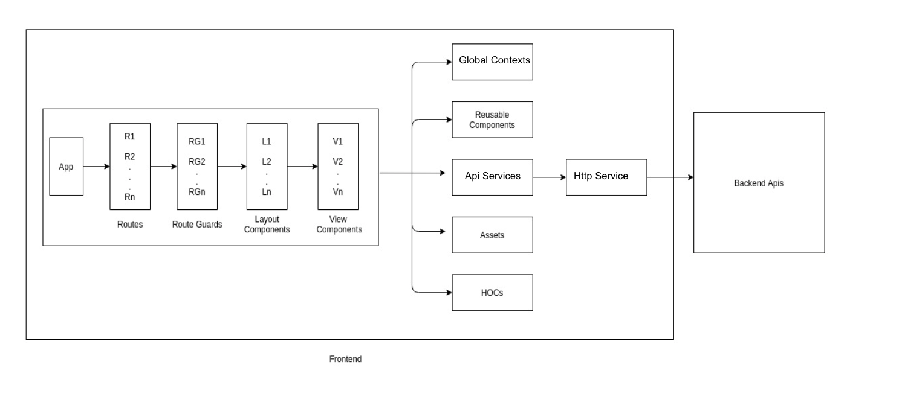

## Tech Stack:
* **Next.js** - React framework for production
* **React.js** - JavaScript library for building user interfaces
* **HTML** - Markup language
* **CSS** - Styling language
* **JavaScript** - Programming language

## Architecture:
Layered architecture is followed to design the frontend, the idea of which is to create self independent layers which are interconnected but do not depend upon each other.

Architecture is built on top of Next.js framework



### Routes:
Correspond to a url. Multiple routes can utilize any combination of RouteGuards, Layouts and Views.

### RouteGuards:
Defines protection layer for all the Layouts and View level components. One route guard can be utilised over many Layouts and View components.

### Layouts:
Provides a fixed structure that is used for various views. One Layout can be utilised over many View components. For example: One layout can be with Header, other with Header and Sidebar and these can be utilised over Login view, Profile view.

### Views:
Defines a screen level component under which data fetchings and assembling of components is done.

### Supporting Layers:

**Reusable components:**
Components that can be used multiple times in application. Generic enough, configured through props and free from complex business logic.

**Hooks:**
Hooks let us organize the logic inside a component into reusable isolated units: Hooks apply the React philosophy (explicit data flow and composition) inside a component, rather than just between the components.

**Global Contexts:**
To manage application level state that can be shared across multiple components there is provision of "Global Contexts" we have in project.

## Project Directory Structure:
```
App
├── public              
└── src
  ├── components
  ├── constants
  ├── globalContext
  ├── hooks
  ├── layouts
  ├── locale
  ├── pages
  ├── routeGuards
  ├── services
  ├── styles
  ├── themes 
  ├── utils
  ├── views
  ├── keycloak.js
  ├── networkInterceptor.js
├── .env
├── .eslintrc.json
├── .gitignore
├── .npmrc
├── Dockerfile
├── jsconfig.json
├── next.config.js
├── package.json
├── README.md
```

### Directory/File Descriptions:

**public**
Public assets For eg: images, fonts etc. added in this folder

**.env**
Environment related configurations added in this file.

**src**
* **components**: Reusable components defined to use across application
* **constants**: Defined constants which are utilised across application
* **globalContext**: Defined Global contexts which are utilised across application
* **hooks**: Defined reusable Hooks which are utilised across application
* **layouts**: Defined reusable Layouts which are utilised across application
* **locale**: Defined locales which are utilised across application
* **pages**: Defined routes for the application
* **routeGuards**: Defined route level protection for the application routes
* **services**: Defined various utility services that are used across application. For eg: Storage service, Http service
* **styles**: Defined global scss and style variables for components
* **themes**: Defined theme tokens which are utilised for Reusable library components
* **utils**: Defined various utilities to support business logic or flows of the application
* **views**: Defined View components of the applications
* **keycloak.js**: Defined keycloak related configuration
* **networkInterceptor.js**: Defined middlewares for network calls

**.eslintrc.json**
Linting related configurations added in this file.

**.gitignore**
Git ignore related configurations added in this file.

**.npmrc**
npm related configurations added in this file.

**Dockerfile**
Containerisation related configurations added in this file.

**jsconfig.json**
Project's JS related configurations added in this file.

**next.config.js**
Next JS related configurations added in this file.

**package.json**
Dependencies, Dev Dependencies and Build related scripts added in this file.

**README.md**
Know how related information of the project added in this file

## Prerequisite:
Node version: 22.0.0

## Run locally:

Proxy urls to be updated: next.config.js

* **const devUrl = [url];**

`yarn run dev`

## Build Steps:
docker file

## Healthcheck:

1.  Endpoint: `/` 

## Ports Used:
* **3000**
if already occupied already, automatically takes next avail port

## Environment Variables
* **CACHE_ENABLED=[true/false]**
* **BASE_URL=[url]**
* **APP_LOGO=[base 64 image]**
* **APP_LOGO_DARK=[base 64 image]**
* **APPLICATION_NAME_ENGLISH=[string]**
* **APPLICATION_NAME_ARABIC=[string]**
* **FAVICON=[base 64 image]**
* **SHOW_EMIRATES_RISKS_DASHBOARD=[true/false]** - Controls visibility of Emirates Risks Dashboard tabs and Emirate filter. Set to 'true' to show, 'false' or leave empty to hide.

* **KEYCLOAK_ENABLED=[true/false]**
// In case Keycloak is enabled
## Mandatory Environment Variables 
* **KEYCLOAK_URL=[url]**
* **KEYCLOAK_REALM=[realm_name]**
* **KEYCLOAK_CLIENT_ID=[cliend-id]**
* **KEYCLOAK_SECRET=[keycloak-secret]**
* **NEXTAUTH_URL=[after_login_redirect_url]**

## Contacts:
1. Service Owner: **Ravi Kharbanda**
2. Email: **ravi@saal.ai**
